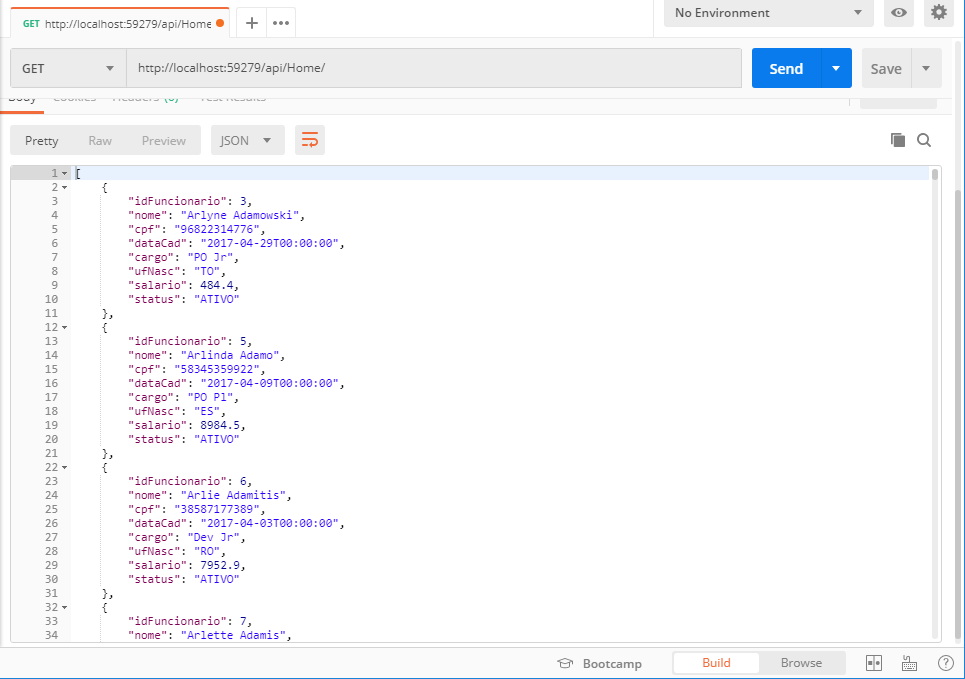

# ASP.NET Core 2.2 WebApi Exemplo com Swagger

Neste respoitório demonstro uma maneira simples de construir um WebAPI com o ASP.NET Core e consumir através de um projeto MVC.

Este repositório contém uma controller ```Funcionario``` onde contém a chamada de ações na API como GET/POST/PUT/PATCH e DELETE

Veja aqui alguns exemplos: 

## Swagger

``` http://localhost:59279/index.html ```


```http://localhost:59279/api/Home/```



## Projeto Strategy

Padrão de Projeto Strategy, criado uma Strategy para cada variante e fazer com que o método delegue o algoritmo para uma instância de Strategy


## Pacotes
Para buildar o projeto serão necessários os seguintes pacotes:
- Microsoft.AspNetCore.App
- Microsoft.EntityFrameworkCore.SqlServer
- Microsoft.Extensions.PlatformAbstractions
- Newtonsoft.Json
- Swashbuckle.AspNetCore

Podem ser instalados pelo seguinte comando nuget:

``` 
Install-Package Microsoft.AspNetCore.App -Version 2.2.0
Install-Package Microsoft.EntityFrameworkCore.SqlServer -Version 2.2.4
Install-Package Microsoft.Extensions.PlatformAbstractions -Version 1.1.0
Install-Package Newtonsoft.Json -Version 12.0.2
Install-Package Swashbuckle.AspNetCore -Version 4.0.1
```


